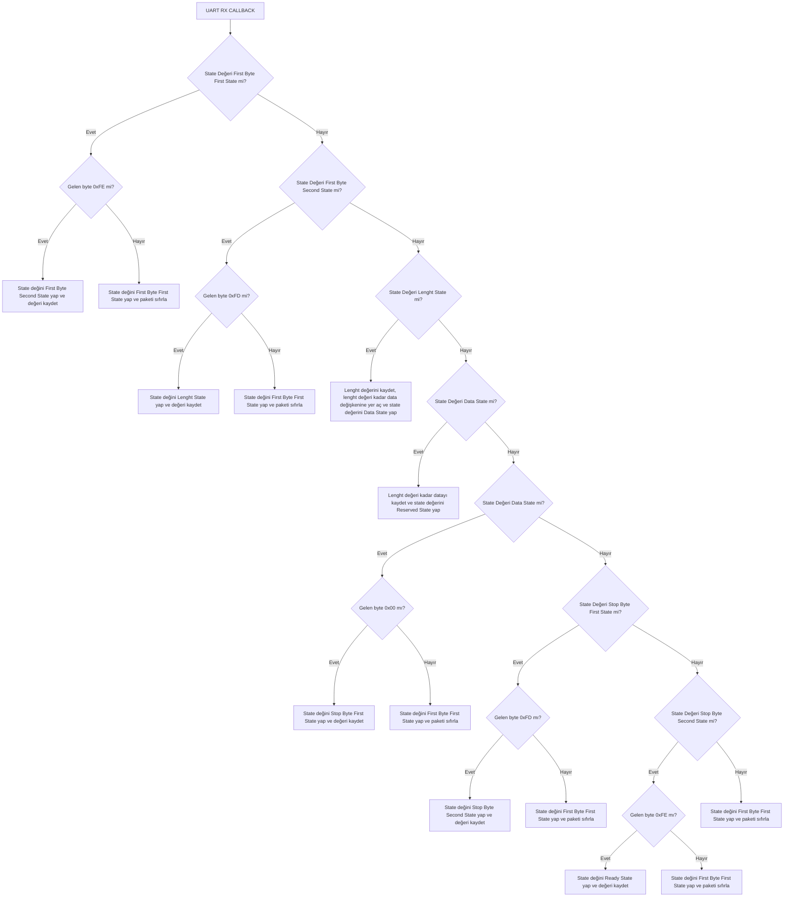

# Tubitak-BILGEM---Proje-3
USART özel veri paketi projesi.

## State Machine

```mermaid
flowchart TD
    A[UART RX CALLBACK] --> FirstStateQ{State Değeri First Byte First State mi?}
    FirstStateQ --> |Evet| FirstStateQYes{Gelen byte 0xFE mi?}
    FirstStateQYes --> |Evet| FirstStateQYesYes[State değini First Byte Second State yap ve değeri kaydet]
    FirstStateQYes --> |Hayır| FirstStateQYesNo[State değini First Byte First State yap ve paketi sıfırla]
    FirstStateQ --> |Hayır| FirstStateQNo{State Değeri First Byte Second State mi?}

    FirstStateQNo --> |Evet| FirstStateQ1Yes{Gelen byte 0xFD mi?}
    FirstStateQ1Yes --> |Evet| FirstStateQ1YesYes[State değini Lenght State yap ve değeri kaydet]
    FirstStateQ1Yes --> |Hayır| FirstStateQ1YesNo[State değini First Byte First State yap ve paketi sıfırla]
    FirstStateQNo --> |Hayır| FirstStateQ1No{State Değeri Lenght State mi?}

    FirstStateQ1No --> |Evet| LenghtStateYes[Lenght değerini kaydet, lenght değeri kadar data değişkenine yer aç ve state değerini Data State yap]
    FirstStateQ1No --> |Hayır| LenghtStateNo{State Değeri Data State mi?}

    LenghtStateNo --> |Evet| DataStateYes[Lenght değeri kadar datayı kaydet ve state değerini Reserved State yap]
    LenghtStateNo --> |Hayır| DataStateNo{State Değeri Data State mi?}

    DataStateNo --> |Evet| ReservedStateQYes{Gelen byte 0x00 mı?}
    ReservedStateQYes --> |Evet| ReservedStateQYesYes[State değini Stop Byte First State yap ve değeri kaydet]
    ReservedStateQYes --> |Hayır| ReservedStateQYesNo[State değini First Byte First State yap ve paketi sıfırla]
    DataStateNo --> |Hayır| ReservedStateQNo{State Değeri Stop Byte First State mi?}

    ReservedStateQNo --> |Evet| StopStateQYes{Gelen byte 0xFD mı?}
    StopStateQYes --> |Evet| StopStateQYesYes[State değini Stop Byte Second State yap ve değeri kaydet]
    StopStateQYes --> |Hayır| StopStateQYesNo[State değini First Byte First State yap ve paketi sıfırla]
    ReservedStateQNo --> |Hayır| StopStateQNo{State Değeri Stop Byte Second State mi?}

    StopStateQNo --> |Evet| StopStateQ1Yes{Gelen byte 0xFE mı?}
    StopStateQ1Yes --> |Evet| StopStateQ1YesYes[State değini Ready State yap ve değeri kaydet]
    StopStateQ1Yes --> |Hayır| StopStateQ1YesNo[State değini First Byte First State yap ve paketi sıfırla]
    StopStateQNo --> |Hayır| StopStateQ1No[State değini First Byte First State yap ve paketi sıfırla]
```
